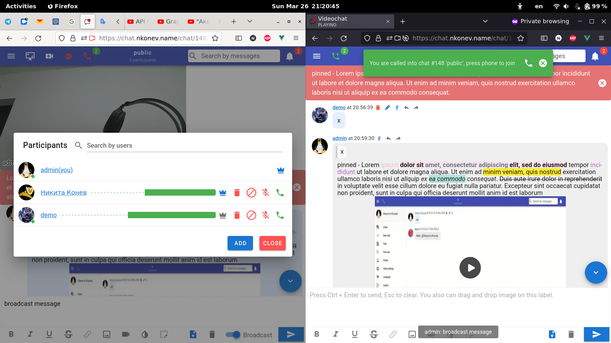

# Videochat
Your open source self-hosted videoconference platform.

# Features:
* Well-integrated video calls into entire platform UI, no separated video rooms, text chats, etc...
* No installation on client's machine - only modern browser with video camera or microphone required.
* Tested in Firefox and Chrome.
* File [sharing](./screenshots.md#chat-files).
* Screen [sharing](./screenshots.md#screen-sharing).
* Multiple cameras support.
* Video recording, recordings are saved to Files.
* One user can use several devices simultaneously (e. g. smartphone / PC / Laptop / ...).
* [Muting, kicking](./screenshots.md#videoconference-and-participant-management) video participants.
* Calling to user to [invite](./screenshots.md#inviting-user-to-videoconference) his or her to video conference.
* User is [speaking indication](./screenshots.md#user-is-speaking-indication-green-nickname-and-microphone).
* Persistent text chats with simple formatting. Messages are persisted regardless video-call session.
* [Tet-a-tet](./screenshots.md#open-tet-a-tet-chat) private chats for two.
* Notifications about `@mentions` and missed video calls.
* Pinned messages.
* Horizontal scaling, including video server itself thanks to Livekit.
* No sticky sessions required.
* Supports [login](./screenshots.md#login) through OpedID Connect providers: Facebook, VK.com, Google, Keycloak. Not required can be disabled.
* LDAP login integration.
* Internationalization: English and Russian UI.
* Firewall friendly: only two ports for WebRTC are needed (TURN, WebRTC).
* Simple setup with docker swarm or docker-compose.
* No vendor lock on cloud provider.
* Familiar infrastructure - PostgreSQL, RabbitMQ, Redis, Jaeger, Minio, Traefik, NGINX.
* Self-contained frontend bundle without any CDN downloads.
* No need to edit `/etc/hosts` for development.

# Try
[Demo](https://chat.nkonev.name/)

See [screenshots](./screenshots.md)

# Installation
* Use docker-swarm [files](./deploy)
* Replace `api.site.local` with your actual hostname, remove 8080 if need
* Configure "ingress" in deploy/traefik_conf/traefik.yml and docker-compose-infra.template.yml
* Open ports to traefik and livekit, described in deploy/docker-compose-infra.template.yml

