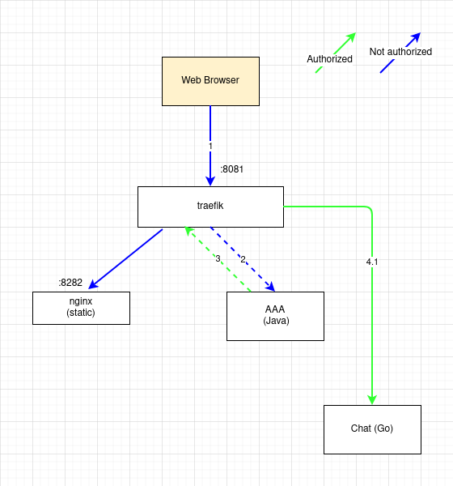
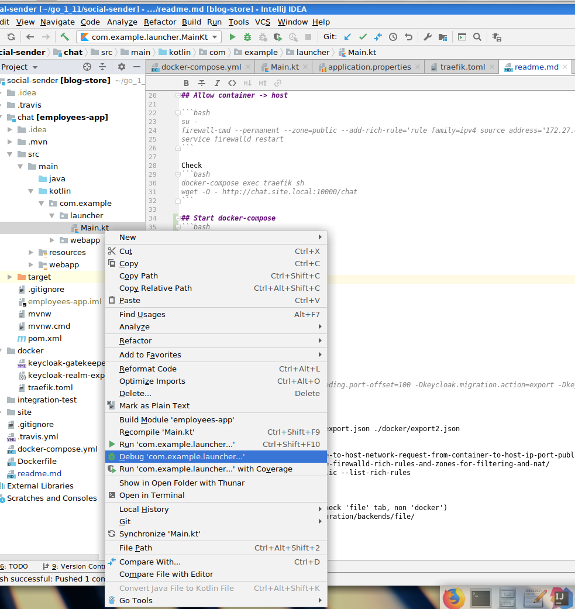
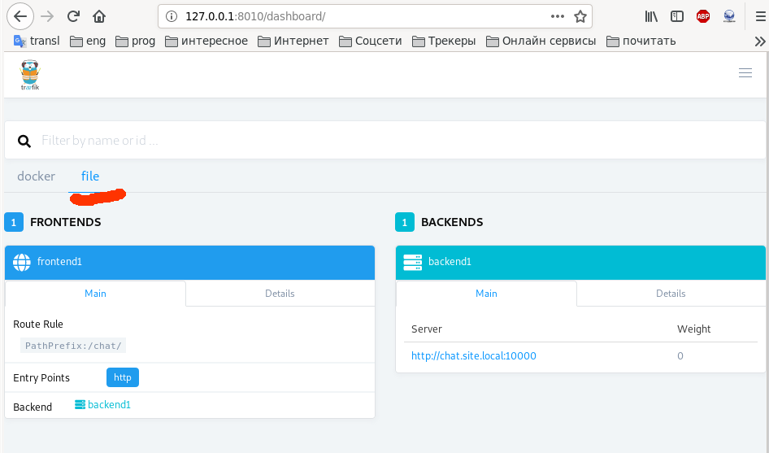
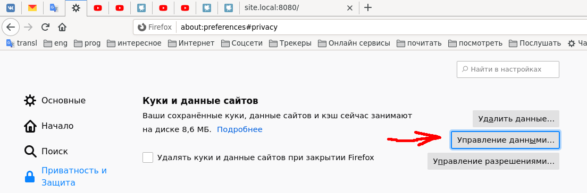
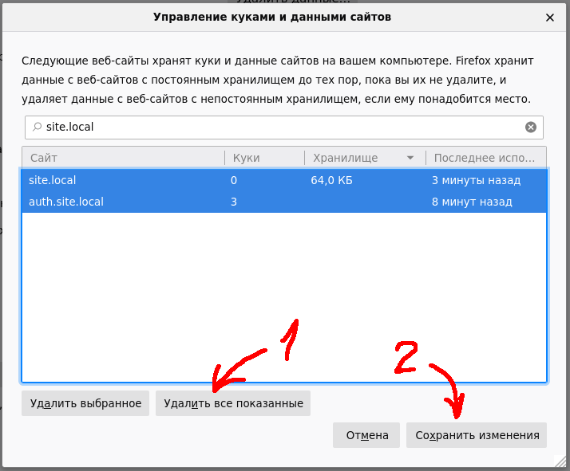

# Building Go part

## (Re)generate go protobufs
```bash
rm -rf ./user-service/grpc
mkdir ./user-service/grpc || true
docker run -it --rm -v $PWD:/ws -w /ws znly/protoc:0.4.0 --go_out=plugins=grpc:user-service/grpc --plugin=protoc-gen-grpc=/usr/bin/protoc-gen-go -I./protobuf ./protobuf/*.proto
```

## Building
```
(cd frontend; npm i; npm run prod;)

cd user-service
go test ./...
go get github.com/gobuffalo/packr/v2/packr2@v2.0.1
packr2 build
```


# Prepare localhost

First of all set proper java 11
```bash
export JAVA_HOME=/usr/lib/jvm/jre-11
java -version
./mvnw clean package
```

Final architecture:



## Add DNS names
`vim /etc/hosts`

```
127.0.0.1   auth.site.local
127.0.0.1   chat.site.local
127.0.0.1   site.local
127.0.0.1   api.site.local
```

## Allow container -> host

```bash
su -
firewall-cmd --permanent --zone=public --add-rich-rule='rule family=ipv4 source address="172.28.0.0/16" accept'
service firewalld restart
```

Check
```bash
docker-compose exec traefik sh
wget -O - http://chat.site.local:10000/chat
```

## Start docker-compose
```bash
docker-compose up -d
```

## Start Chat application from IDE


# Test auth - in browser

If all configured correctly - you will redirected to authentication page, then after successful authentication you
will get chat's html.

1. Open `http://site.local:8080/chat`
2. Use `tester:tester` for authentication.
3. Assert `Hello World!` is present
4. Click `Json` link
5. Assert `$.helloMessage` is `Hello Nikita Konev`

# Misc

## Firewalld help
[Solve no route to host whe invoke host from container by add firewalld rich rule](https://forums.docker.com/t/no-route-to-host-network-request-from-container-to-host-ip-port-published-from-other-container/39063/6)

[Firewalld examples](https://www.rootusers.com/how-to-use-firewalld-rich-rules-and-zones-for-filtering-and-nat/)
```bash
firewall-cmd --permanent --zone=public --list-rich-rules
firewall-cmd --get-default-zone
```
## Traefik
[dashboard](http://127.0.0.1:8010/dashboard/) (check 'file' tab, non 'docker')


[file provider documentation](https://docs.traefik.io/v1.7/configuration/backends/file/)


# Clean .site.local cookies
1. 
2. 

# Development
[node check updates](https://www.npmjs.com/package/npm-check-updates)

[Error:java: invalid source release: 8](https://stackoverflow.com/a/26009627)

[Reactive, Security, Session MongoDb](https://medium.com/@hantsy/build-a-reactive-application-with-spring-boot-2-0-and-angular-de0ee5837fed)

https://www.baeldung.com/spring-session-reactive

# AAA
```
curl -v 'http://localhost:8060/api/login' -H 'Accept: application/json, text/plain, */*' -H 'Content-Type: application/x-www-form-urlencoded' --data 'username=admin&password=admin'
```

```
./mvnw -pl aaa-api install
./mvnw install -N -DskipTests
./mvnw -pl aaa-backend compile
```

```
docker exec -t videochat_postgres_1 pg_dump -U aaa -b --create --column-inserts --serializable-deferrable
```