# Login
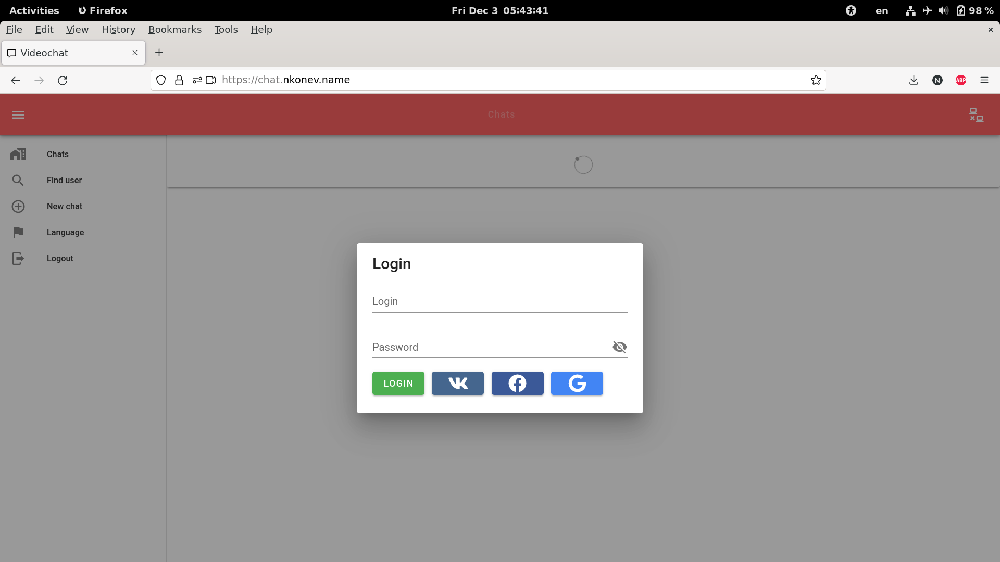

# Main chats view, new messages and active call icons
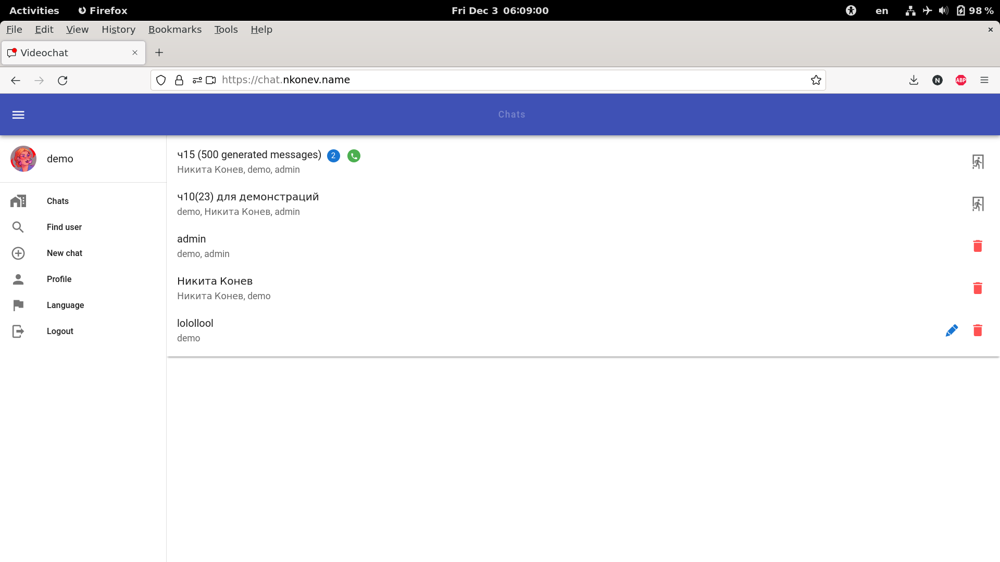

# Videoconference and participant management

# User is speaking indication (green nickname and microphone)
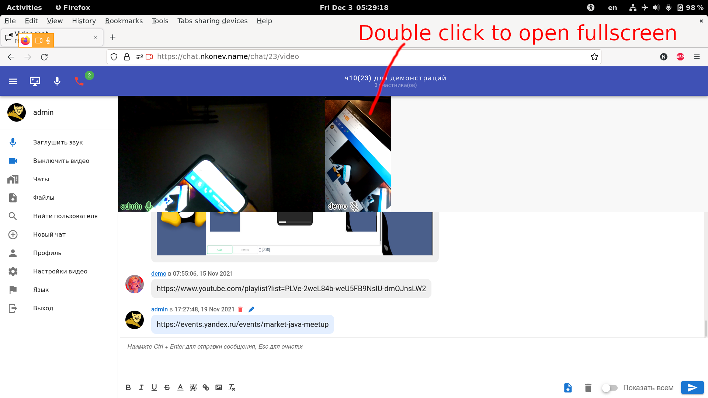

# Pictures in chat
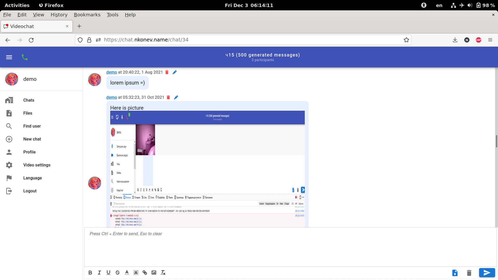

# Chat files
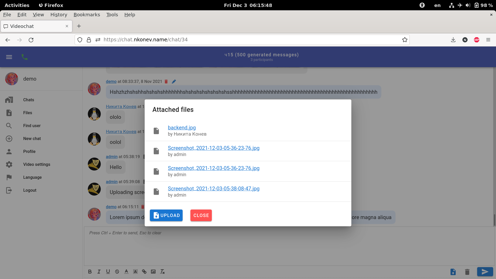
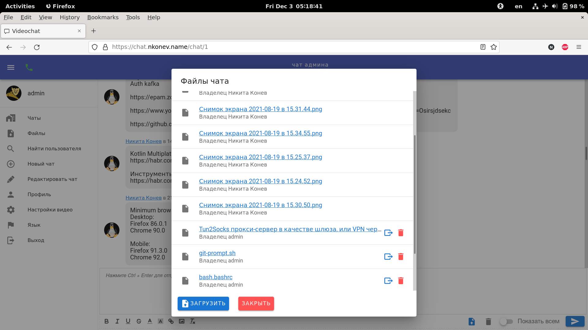

# File uploading
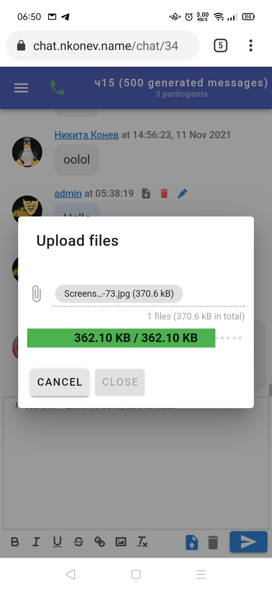

# Inviting user to videoconference
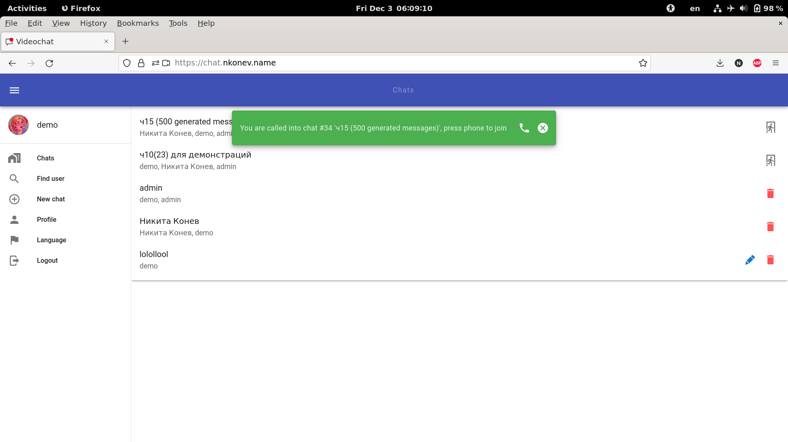
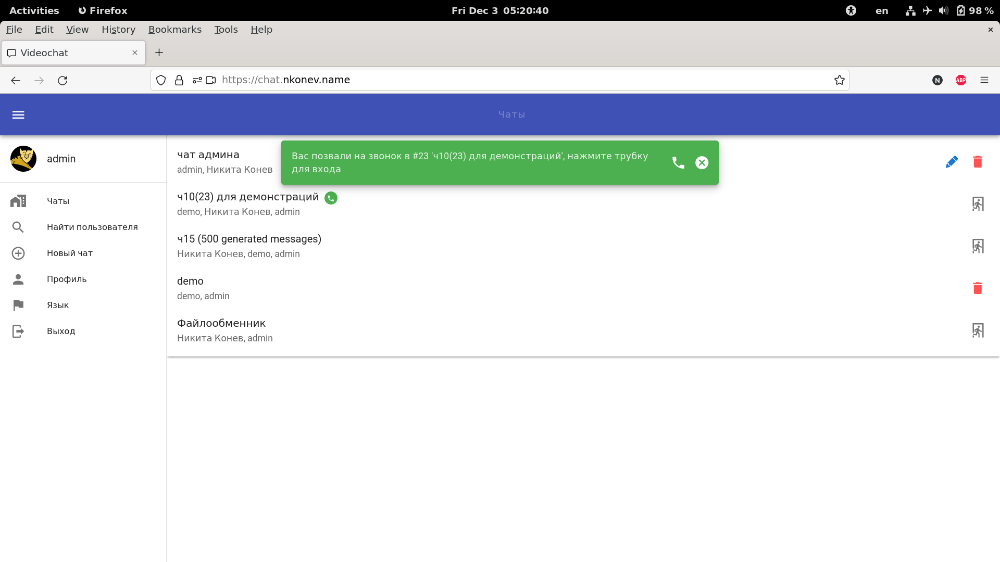

# Message from admin
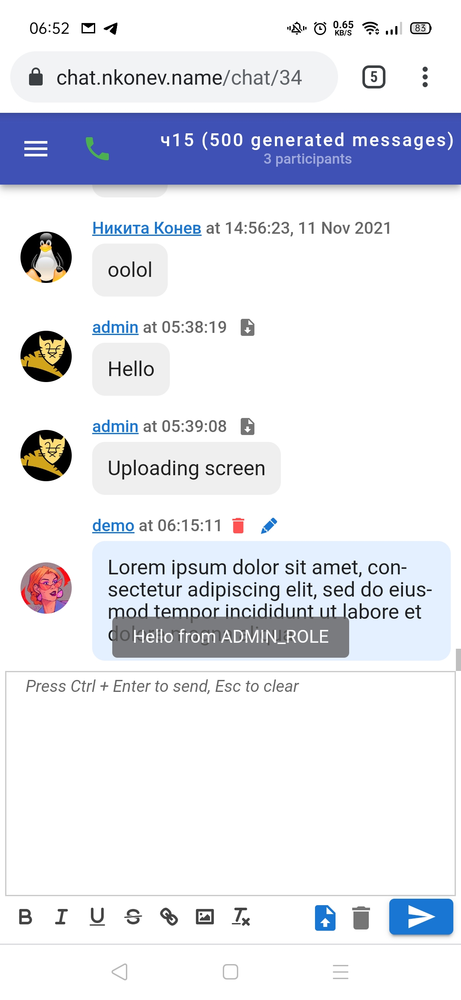

# Searching user
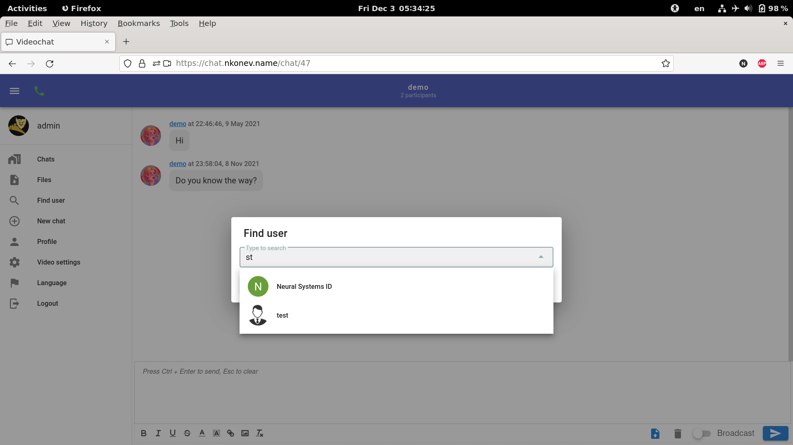

# Video settings
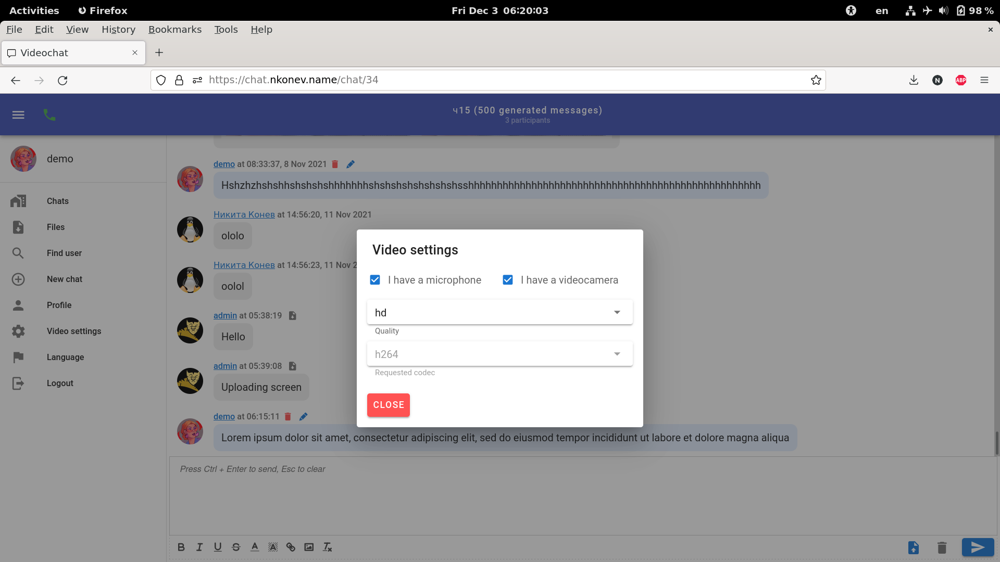